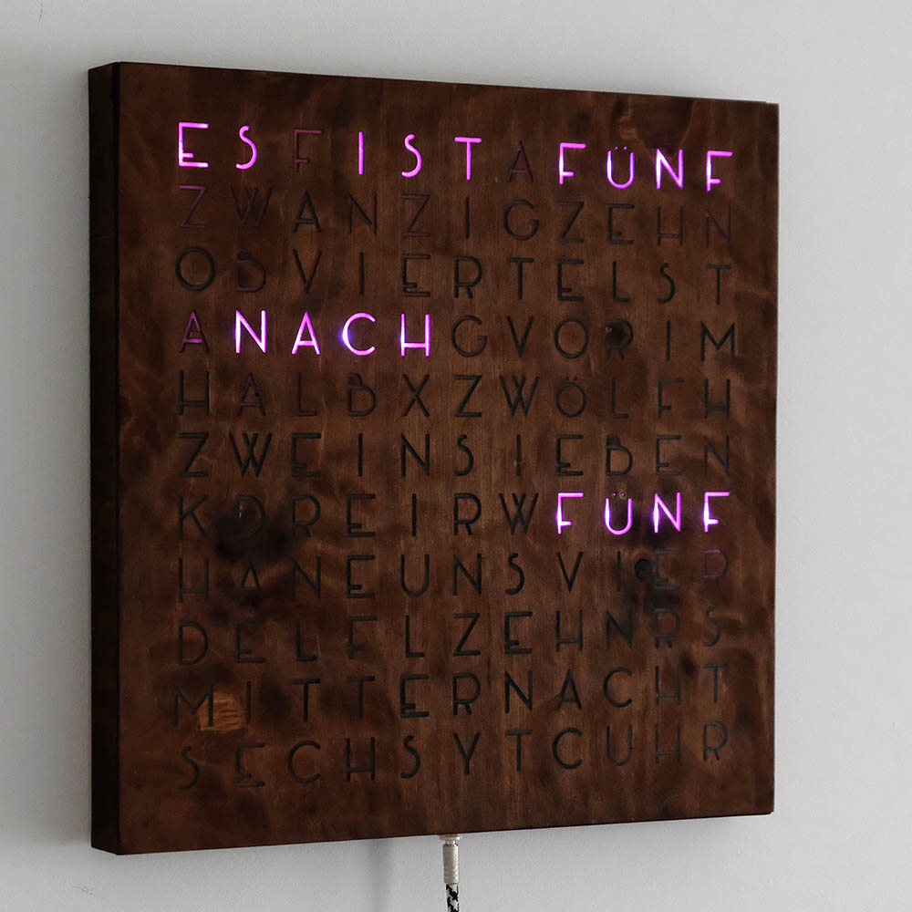

# Wordclock
Wordclock with German layout ESP32 project. Design inspired by [grahamvinyl on Imgur](https://imgur.com/a/dtLSy).

Libraries used:
 - [FastLED](https://github.com/FastLED/FastLED)
 - [RTClib](https://github.com/adafruit/RTClib)

## Specs
 - 11x11 WS2812b LEDs
 - Two physical buttons
 - DS3231 real time clock
 - Photoresistor for brightness measurement

## Functionality
 - Show current time
 - Memorize time even when unplugged
 - Adjust brightness to room's lighting
 - Change color on button press
 - Adjust time +1 -1 +0 hours on button press (daylight saving time)